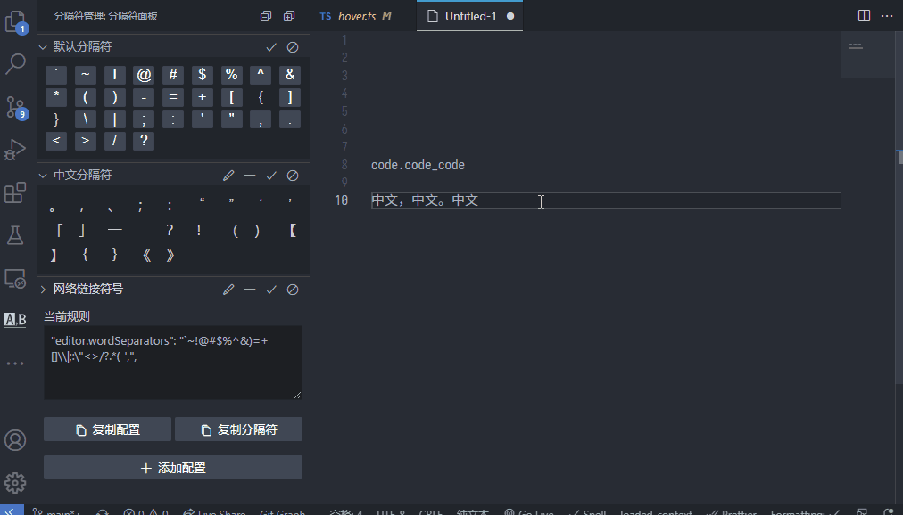

# Word Separator Manage 分隔符配置

Easily toggle and manage vscode word separator
切换、配置vscode文字分隔符

---

- Toggle separators to select text by hovering text;
- hover文字，切换分隔符以选中文字

---

Toggle dash to select text 切换横杠选中效果

---

Toggle Chinese separators to select text 切换中文分隔符选中效果

---

Configuration reference 配置参考

| property 属性               | type 类型   | explain 说明                                                                                                                                 | example 示例                                         |
| --------------------------- | ----------- | -------------------------------------------------------------------------------------------------------------------------------------------- | ---------------------------------------------------- |
| `WordSeparator.group`     | `Array`   | Config group for Word Separators 配置分隔符规则列表                                                                       | `[{"name": "default", separators: "~!@#$%^&*()"}]` |
| `WordSeparator.silent`    | `Array`   | Disable notifications 禁用通知                                                                                                      | `["hover", "panel"]`                               |
| `WordSeparator.hover`     | `Boolean` | Enable/Disable (hover display separator management) and (separator highlighting) 启用/取消(hover显示分隔符管理)和(分隔符高亮)                                                        | `true`                                             |
| `WordSeparator.highlight` | `Object`  | Configure the separator highlighting effect 配置分隔符高亮效果 <https://vshaxe.github.io/vscode-extern/vscode/DecorationRenderOptions.html> | `{ backgroundColor: "red" }`                       |

---

Try more by yourself 😀
