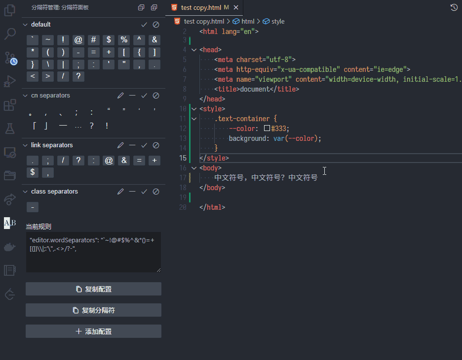
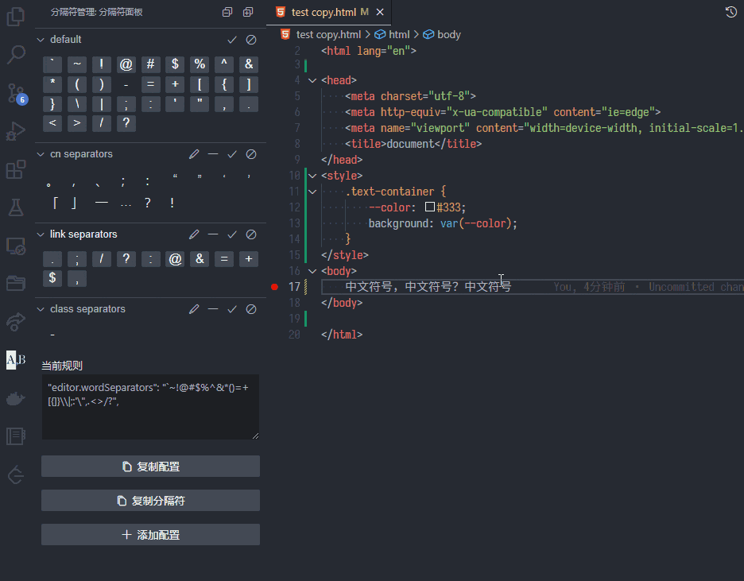

# Word Separator Manage 分隔符配置

Easily toggle and manage vscode word separator
切换、配置vscode文字分割符

***

- Toggle dash to select text
- 切换横杠选中效果

***

- Toggle Chinese separators to select text
- 切换中文分隔符选中效果

Try more by yourself 😀
